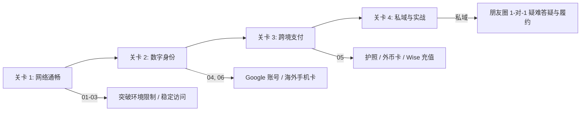

> **“跟老海一起，通往自由、高效与安全的全球数字世界。”**  
> 本指南由 **老海和他的朋友们 (Old Sea & Friends)** 倾力打造，所有核心教程与基础方案**永久开源免费**。

---

## 🧭 专栏前言与初衷

今天为什么会有这个指南？

因为身边越来越多想要出海、尝试 AI 工具、或体验全球优质互联网服务的朋友，常常在**网络访问、海外账号注册、跨境支付**这三大基础关卡上踩坑——要么被高昂的“翻墙套路”割韭菜，要么因操作不当导致账号被封或资金受损。

我们希望通过这套**零基础、无门槛、全图文**的指南，把背后真实的底层逻辑和避坑经验分享给你，帮助你建立属于自己的全球化数字基础设施。

---

## 🗺️ 全球数字公民成长路径

---

## 📚 本指南全量目录 (开源免费)

### 🚀 第一阶段：网络环境与基础通畅
- [💡 01｜为什么要建立全球化网络观？](01_why_share) —— 解码网络主权、GFW 机制与合规避坑常识。
- [📊 02｜全球化网络资产清单与成本核算](02_network_assets) —— 个人出海必备资产盘点（节点、硬件、账号、卡片）。
- [🚀 03｜三步快速跑通国际互联网访问](03_quick_access) —— 识别设备、挑选客户端、三步秒开全球网络。

### 🆔 第二阶段：全球数字身份构建
- [🆔 04｜如何申请谷歌账号 (Google Account)](04_google_account) —— 解锁 Gmail、YouTube 与全局 AI 通行证。
- [📱 06｜海外电话卡选购与避坑指南](06_sim_cards) —— 实体香港卡/美国卡选购，破解接码与验证难题。

### 💳 第三阶段：跨境支付与实体准备
- [💳 05｜国内先行准备：证件与支付工具](05_preparation) —— 护照、港澳通行证与外币信用卡申请全攻略。

---

## 🤝 免费方案与朋友圈私域服务说明

为了让每一位朋友都能高效获得帮助，我们明确划分了服务边界：

| 服务类型 | 包含内容 | 形式 / 获取方式 |
| :--- | :--- | :--- |
| **免费开源方案** | 全套网络配置、软件下载、账号注册、避坑指南 | 本在线指南 (`oldsea.me/network-guide`) |
| **朋友圈私域服务** | 1-对-1 复杂网络/账号疑难排查、手动代充/代开卡履约 | 添加微信进入“老海和他的朋友们”朋友圈 |

> **💡 遇到个性化难题？**  
> 如果你在按照教程操作过程中遇到特定节点的疑难报错、账号风控解除排查，或需要安全便捷的**外币代充/虚拟卡履约服务**，欢迎添加微信加入**“老海和他的朋友们”**私域朋友圈，获取进一步的专业支持与交流！
